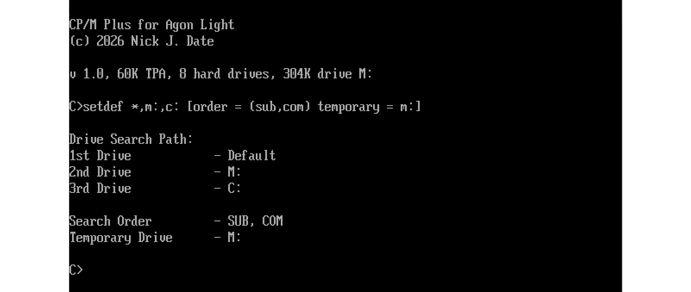

# CP/M Plus for Agon Light

1. [About](#about)
2. [Installation](#installation)
3. [Disc Drives](#disc-drives)
4. [FIDs](#fids)
5. [Memory Map](#memory-map)
6. [Known Issues and Future Improvements](#known-issues-and-future-improvements)

## About

This is a port of CP/M Plus (also known as CP/M 3) for the [Agon Light](https://www.olimex.com/Products/Retro-Computers/AgonLight2/open-source-hardware) open source modern retro computer.

It is styled after Amstrad CP/M Plus for the [CPC](https://en.wikipedia.org/wiki/Amstrad_CPC) and [PCW](https://en.wikipedia.org/wiki/Amstrad_PCW) range of computers.

The supervisor is based, in part, on the [Agon CP/M 2.2](https://github.com/nihirash/Agon-CPM2.2) port by Aleksandr Sharikhin (nihirash). If you like this project, then please check out his project, and maybe [buy him a coffee](https://ko-fi.com/D1D6JVS74). Personally, I'm a tea man.



### Features

* Bank switching between two eZ80 64K segments.
* Field Installable Device Drivers (FIDs) for additional hardware support.
* 60.76KB TPA.
* Up to 8x 8MB hard drive images, using the `nihirash` [CP/M Tools](https://github.com/lipro-cpm4l/cpmtools) [definition](./diskdefs) to maintain compatibility with [CP/M 2.2](https://github.com/nihirash/Agon-CPM2.2).
* Time and date support.
* 304KB RAM drive.

[Top](#cpm-plus-for-agon-light)

---
## Installation

1. Copy the contents of the `bin/` directory to a new subdirectory on your Agon Light's SD card e.g. `/cpm3`

2. Boot the Agon. If it automatically boots into BBC BASIC then enter: `*BYE`

3. Change to the subdirectory you copied CP/M Plus to, and run `cpm3.bin` e.g.

```
/ *cd cpm3
/cpm3 *cpm3
```

[Top](#cpm-plus-for-agon-light)

---
## Disc Drives

Drives `A:` and `B:` are reserved for floppy drives (real or emulated), which can be implemented using [FID](#fids) drivers.

Drives `C:` to `J:` are hard disc files named `cpmX.dsk`, where `X` is indicating the letter of the drive. They use the `nihirash` disc definition.

Drive `M:` is a RAM disc, 304KB in size, of which 288KB is free for files. The contents of this drive will not survive a reset or a power cycle.

Other non-reserved drive letters can also be used for FIDs.

[Top](#cpm-plus-for-agon-light)

---
## FIDs

Field installable device drivers, or FIDs, allow drivers to be loaded at boot time. The `FID.INI` file specifies the names and location of these FIDs.

By default, all FIDs from the `fid/` directory are loaded. If `FID.INI` is absent, or names no drivers, CP/M simply starts without any; a driver that fails to load is reported by name and skipped, and the rest still load.

There is an example FID, `fid/RAMD.FID`. You can test this by copying into the `fid/` subdirectory on your SD card where CP/M Plus is installed.

For information about writing your own FIDs, [see here](fid/FID.md).

[Top](#cpm-plus-for-agon-light)

---
## Memory Map

```
$000000-$01FFFF  eZ80 on-chip flash (MOS)
$040000-$04FFFF  Segment $04 - ADL-mode supervisor and the FID heap
$050000-$05FFFF  CP/M bank 1 - TPA (60.76KB)
$060000-$06FFFF  CP/M bank 0 - System Bank
$070000-$0BBFFF  RAM Drive (311,296 bytes)
$0BC000-$0BFFFF  MOS Data, Heap and Stack (DO NOT TOUCH!)
```

Inside segment `$04`:

```
$040000-$042505  Supervisor (cpm3.bin)
$040100-$040143  Gate Table - Fixed address, append only
$040180-$0401FF  SVC Table - Fixed address, append only
$042506-$044505  CCP Buffer (8K)
$044506-$04FFFF  FID Heap (47,866 bytes)
```

[Top](#cpm-plus-for-agon-light)

---

## Known Issues and Future Improvements

### FID.INI Size

The maximum size of `FID.INI` is 512 bytes, and anything past that limit will not be parsed. This should be enough, though, as wildcards are allowed.

### RTC

The clock is synced with the ESP's time when CP/M boots, and then maintains its own time. This is because, after entering terminal mode, it is not possible to retrieve the time again from the ESP without pausing the terminal.

Note that while you can set the CP/M clock using the `DATE.COM` utility by typing `DATE SET`, the time stays in CP/M, and is not written back to the ESP.

### Stray Character When Changing Drive

The first time you change away from a disc drive that has been written to, a `ç` appears on screen and there is a pause of about a second before the new prompt.

CP/M keeps one disc image open at a time and opens the next on demand, so changing drives closes the image you are leaving. MOS timestamps a file when it closes it, and to get the time it asks the VDP for it. CP/M has put the VDP into terminal mode by then, so the four bytes of that request are printed as characters instead of being interpreted as a command, and no reply can come back. MOS waits about a second for one, gives up, and stamps the file with the last time it knew about instead. The character you see is the third byte of the request.

Only a drive that has actually been written to is affected, and only the first time you leave it. Drives `M:` and any RAM drive supplied by a FID are never affected, as they do not use files on the SD card.

If a `PROFILE.SUB` is present, the CCP writes a temporary file to the boot drive at every startup, so the first drive change after booting will always show this.

Nothing is lost or corrupted: the file's contents are untouched, and only its timestamp on the SD card is affected. That timestamp will show roughly when CP/M was started rather than when the drive was changed, because MOS cannot read the clock again once CP/M owns the terminal.

### GSX Graphics

I would like to investigate the possibility of implementing CP/M's [GSX](https://en.wikipedia.org/wiki/GEM_(desktop_environment)#GSX) (Graphics System Extension) standard in CP/M Plus. Of course, this would require graphics mode switching, as graphics cannot be drawn in terminal mode.

Note that it is unlikely that all of the Agon's graphics modes would be supported.

[Top](#cpm-plus-for-agon-light)